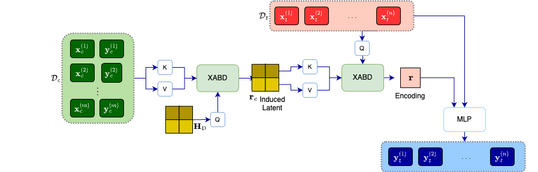

# Inducing Point Neural Processes


This repository is used to implement the Neural Processes experiments from [Semi-Parametric Inducing Point Networks and Neural Processes](https://openreview.net/forum?id=FE99-fDrWd5).

## Acknowledgements
This repository is largely based on the implementation of [Transformer Neural Processes](https://github.com/tung-nd/TNP-pytorch), which in turn was based on [Bootstrapping Neural Processes](https://github.com/juho-lee/bnp).

## Install

Install the dependencies as listed in `ipnp_env.yml` and activate the environment:

```shell
conda env create -f ipnp_env.yml
conda activate ipnp
```

## Usage

Use the `run_regression_trainer_slurm.sh` to launch regression jobs using a SLURM queue manager:
```
./run_regression_trainer_slurm.sh \
  --exp <gp |celeba> \
  --mode <train | eval> \
  --model <anp | banp | canp | ipanp | ipcanp> \
  --seed <seed> \
  --max_num_ctx <max_num_ctx> \
  --min_num_ctx <min_num_ctx> \
  --max_num_tar 64 \
  --min_num_tar 4
```

To run the `trainer.py` file directly:
```
cd ./regression
python trainer.py <gp | celeba> <train | eval> \
  --expid <unique_exp_id> \
  --train_seed=<seed> \
  --eval_seed=<seed> \
  --model=<anp | banp | canp | ipanp | ipcanp> \
  --max_num_ctx=<max_num_ctx> \
  --min_num_ctx=<min_num_ctx> \
  --max_num_tar=64 \
  --min_num_tar=4
```


## Citation

If you find this repo useful in your research, please consider citing our paper:
```
@inproceedings{
    rastogi2023semiparametric,
    title={Semi-Parametric Inducing Point Networks and Neural Processes},
    author={Richa Rastogi and Yair Schiff and Alon Hacohen and Zhaozhi Li and Ian Lee and Yuntian Deng and Mert R. Sabuncu and Volodymyr Kuleshov},
    booktitle={The Eleventh International Conference on Learning Representations },
    year={2023},
    url={https://openreview.net/forum?id=FE99-fDrWd5}
}
```

